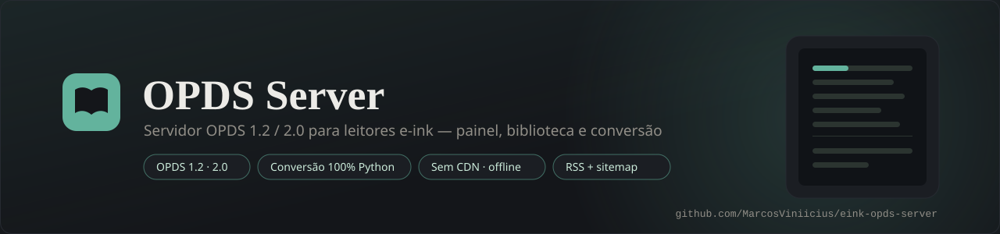
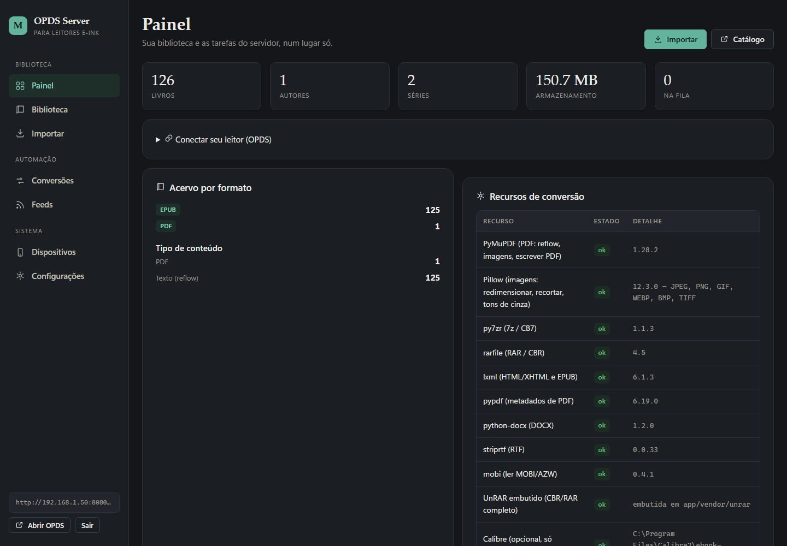
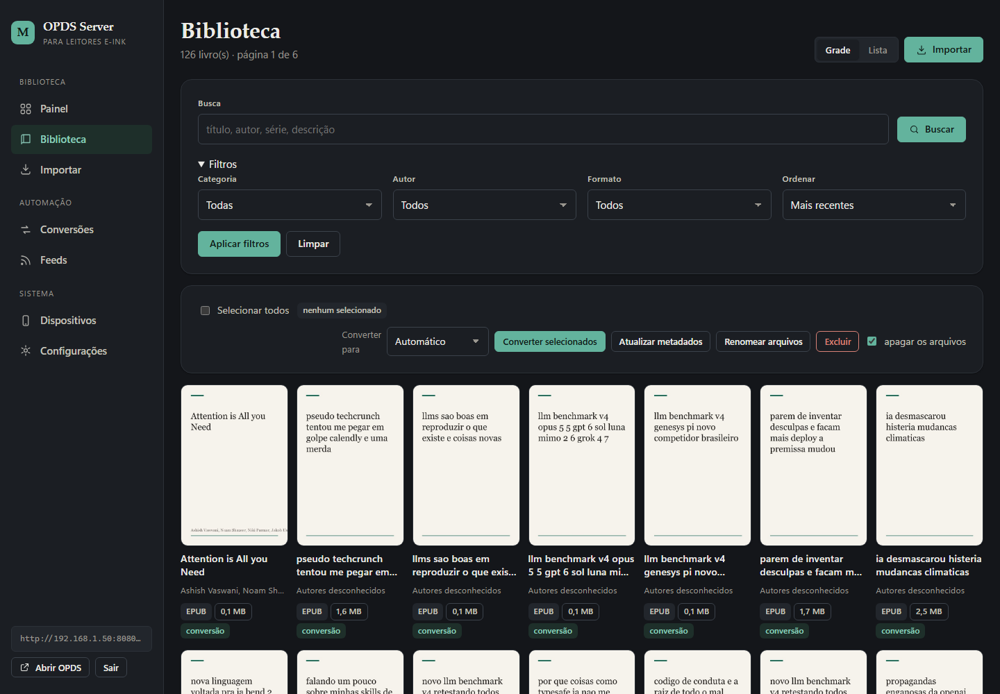
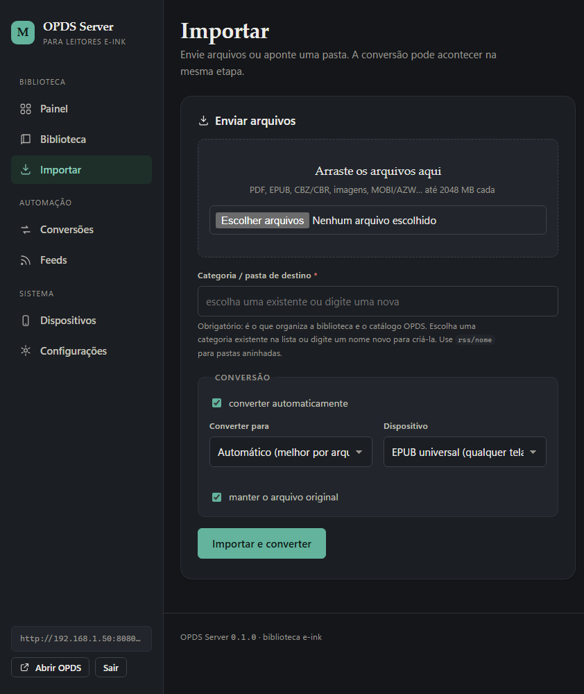
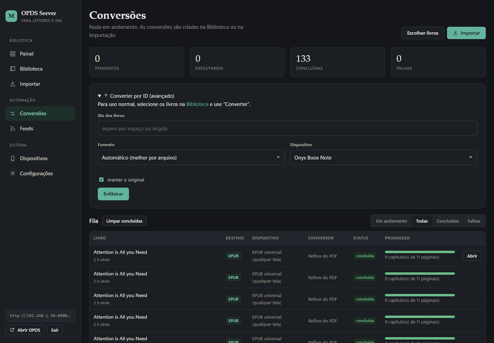
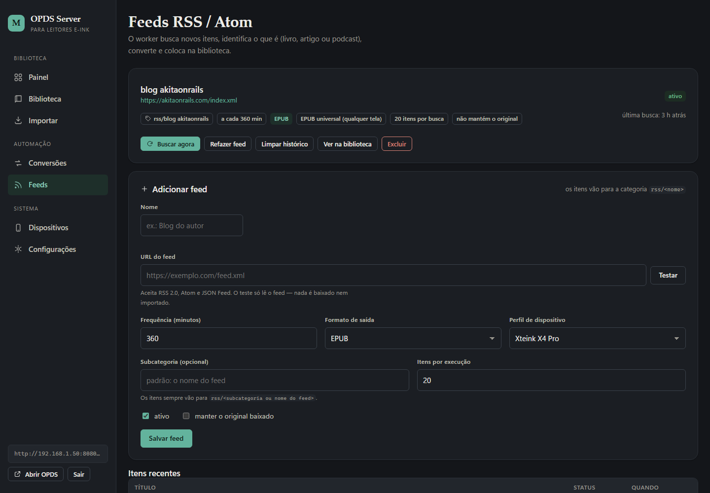
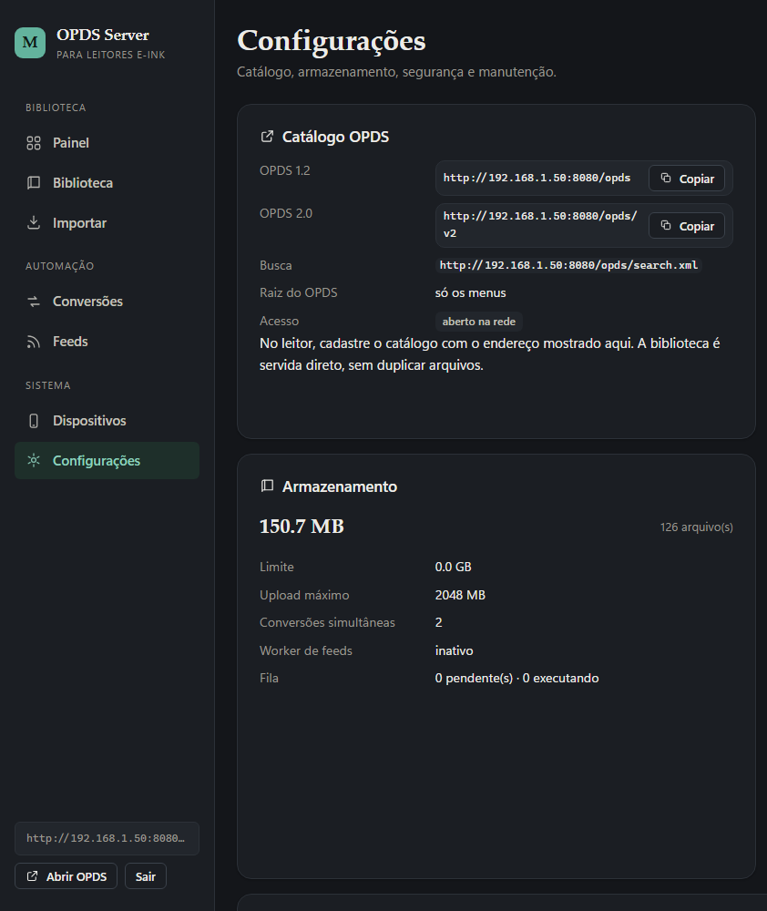
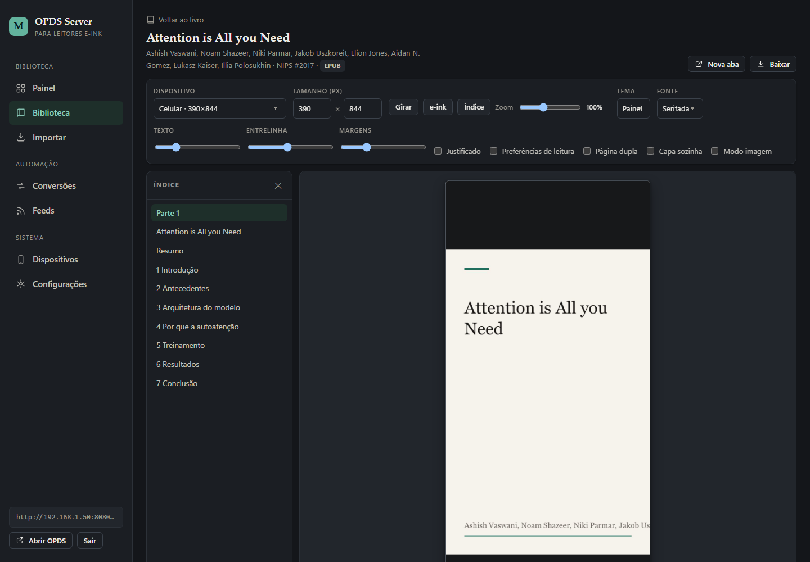
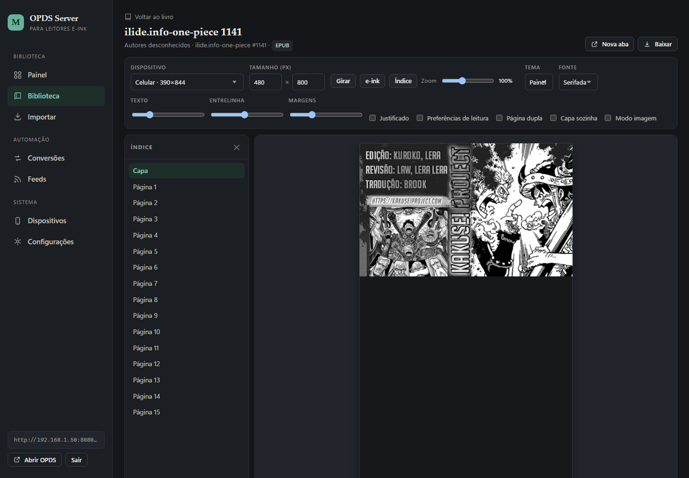
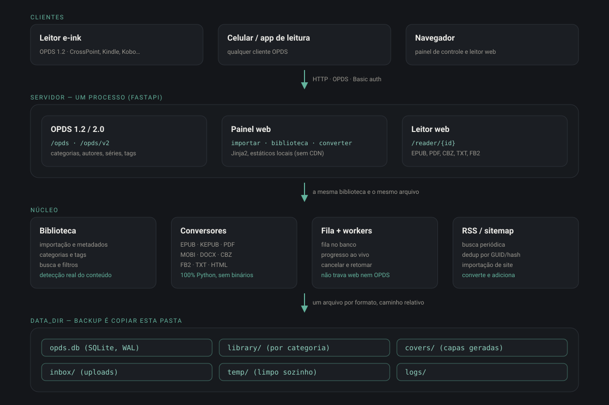

# InkPort




Servidor **OPDS 1.2 (Atom) / 2.0 (JSON)** para leitores e-ink em geral — Kindle,
Kobo, PocketBook, Boox, Tolino, reMarkable, Xteink e outros — com **painel web**,
biblioteca centralizada, fila de conversão e ingestão automática por RSS/Atom.

Perfis de dispositivo prontos definem tela, formato nativo e o pipeline de
imagem ideal; o **Xteink X4 Pro é um preset entre vários**, não o foco. Um perfil
genérico de 6" e um "EPUB universal" cobrem o resto.

Roda bem em um VPS barato ou hardware modesto: **um processo**, SQLite, sem
microserviços e sem filas externas — e **sem depender de nenhum programa
externo** (nada de Calibre, Ghostscript, poppler, ImageMagick ou FFmpeg).

> Documentação: [Arquitetura](docs/architecture.md) ·
> [Painel](docs/panel.md) · [OPDS](docs/opds.md) · [Conversão](docs/conversion.md) ·
> [Dispositivos](docs/device-formats.md) · [RSS](docs/rss.md) ·
> [Segurança](docs/security.md) · [Containers](docs/devops/containers.md) ·
> [Desenvolvimento](docs/development.md) · [IA/agentes](AGENTS.md)

---

## Índice

- [O que é](#o-que-é)
- [Destaques](#destaques)
- [Capturas de tela](#capturas-de-tela)
- [Dispositivos com preset](#dispositivos-com-preset)
- [Requisitos](#requisitos)
- [Instalação](#instalação)
- [Executar](#executar)
- [Primeiro uso](#primeiro-uso)
- [Importação (individual e em massa)](#importação-individual-e-em-massa)
- [Conversão (individual e em massa)](#conversão-individual-e-em-massa)
- [OPDS](#opds)
- [Configurar o e-reader](#configurar-o-e-reader)
- [Feeds RSS/Atom e importação de sites](#feeds-rssatom-e-importação-de-sites)
- [Leitor web](#leitor-web)
- [API REST](#api-rest)
- [Configuração (`.env`)](#configuração-env)
- [Estrutura do projeto](#estrutura-do-projeto)
- [Testes](#testes)
- [Docker (opcional)](#docker-opcional)
- [Backup e manutenção](#backup-e-manutenção)
- [Limites e segurança](#limites-e-segurança)
- [Solução de problemas](#solução-de-problemas)

---

## O que é

Um servidor pessoal que organiza seus livros, **converte sob demanda** para o
formato que cada leitor entende e publica tudo como um catálogo OPDS — o formato
que os e-readers e apps de leitura usam para baixar livros por Wi-Fi, sem cabo e
sem nuvem.

Componentes, em uma frase cada:

- **Painel web** (`/`): importar, organizar, converter, ver progresso e configurar.
- **Catálogo OPDS** (`/opds`): o que o e-reader acessa.
- **Biblioteca**: um diretório sob `DATA_DIR` com os arquivos + um banco SQLite
  com os metadados.
- **Fila de conversão**: workers em background convertem sem travar o servidor.
- **Feeds**: um agendador busca RSS/Atom, baixa e converte automaticamente.

## Destaques

- **OPDS 1.2 (Atom) e OPDS 2.0 (JSON)** com navegação por categorias, autores,
  séries e tags, capas, miniaturas, busca OpenSearch e download direto.
- **Painel web** para upload, importação de pastas, edição de metadados e capa,
  renomear/mover/excluir, biblioteca com busca e filtros, e visão de espaço.
- **Conversão modular — 100% Python**: EPUB de imagens adaptável (universal) ou
  por dispositivo, CBZ, PDF de imagens, compressão, EPUB otimizado, e conversores
  nativos para **KEPUB, MOBI/AZW3, PDF (ler e escrever), DOCX, FB2 e TXT**, sem
  depender de Calibre, Ghostscript, poppler, ImageMagick ou FFmpeg.
- **Qualidade de PDF/mangá no nível do KCC**: extrai o scan embutido em vez de
  re-renderizar, calcula o DPI a partir do alvo, autocontraste e realce
  opcionais, grayscale com Lanczos e limites que o aparelho aceita.
- **PDF com texto refluído nativamente** (PyMuPDF): títulos por tamanho/peso,
  de-hifenização, remoção de cabeçalho/rodapé, leitura coluna a coluna, figuras
  e tabelas reconstruídas no EPUB.
- **Arquivos compactados sem binários externos**: ZIP/CBZ, TAR, 7z/CB7 (py7zr) e
  RAR/CBR via `unrar.dll` distribuída com o projeto (inclusive *solid*).
- **Detecção real do conteúdo** (extensão + magic bytes + inspeção do container).
- **Escolha automática de estratégia** conforme tipo do arquivo, conteúdo e
  dispositivo de destino.
- **Importação em massa**: vários arquivos de uma vez ou uma pasta inteira
  (recursiva), sempre vinculados **a uma categoria**.
- **Conversão em massa**: selecione vários livros na biblioteca, escolha formato
  e dispositivo e enfileire tudo de uma vez.
- **RSS/Atom automático**: worker busca, baixa, detecta, converte e adiciona à
  biblioteca, com dedup por GUID/URL/hash. Aceita qualquer feed: anexo de livro,
  artigo completo no feed, só link, página bloqueada (usa o texto do feed) e
  podcast (ignorado, sem erro).
- **Importador de site**: varre um `sitemap.xml` e traz acervos históricos.
- **Fila persistente** com concorrência configurável, retomada após interrupção,
  progresso em tempo real, cancelamento de verdade e limpeza de temporários.
- **Leitor web** embutido (EPUB, PDF, CBZ, TXT, FB2…) para conferir antes de
  mandar para o aparelho.
- **Sem CDNs**: todo CSS/JS é servido localmente; funciona offline na rede local.

## Capturas de tela

Imagens reais do painel (tema escuro, acervo de exemplo).

| Painel | Biblioteca |
| --- | --- |
|  |  |

| Importar | Conversões |
| --- | --- |
|  |  |

| Feeds RSS/Atom | Configurações |
| --- | --- |
|  |  |

| Leitor web: artigo refluído | Leitor web: mangá (EPUB de imagens) |
| --- | --- |
|  |  |

Mais telas (dispositivos e ficha do livro) em [`docs/panel.md`](docs/panel.md).

## Dispositivos com preset

| Marca | Perfis |
| --- | --- |
| Genérico | E-ink 6" (padrão), E-ink 7" |
| Universal | EPUB universal (qualquer tela), Mangá universal |
| Amazon | Kindle Paperwhite, Kindle 11ª geração, Oasis, Scribe, Colorsoft, Kindle antigo (MOBI) |
| Kobo | Clara HD/2E, Libra 2, Sage, Elipsa, Clara Colour |
| PocketBook | Era, InkPad |
| Boox | Palma, Note |
| Tolino | Vision 6, Shine 3 |
| reMarkable | 2, Paper Pro |
| Xteink | X4 Pro, X4 Pro (mangá) |
| Tela grande | Tablet / celular |

Dá para criar perfis próprios no painel (tela, cor, níveis de cinza, spreads,
qualidade, formato de imagem).

## Requisitos

- **Python 3.11+** (testado em 3.14) — **nada mais precisa ser instalado**.
  Todas as conversões usam pacotes Python (`pip install -r requirements.txt`) e a
  biblioteca UnRAR que acompanha o projeto em `app/vendor/unrar` para abrir
  CBR/RAR. **A DLL é do Windows**: no Linux/macOS o `rarfile` usa o
  `bsdtar`/`unrar` do sistema, se existir (o painel mostra o que está disponível).
- Opcional: se a máquina já tiver **Calibre** (`ebook-convert`), ele é usado
  apenas como último recurso para formatos exóticos (`.lit`, `.odt`, `.doc`).
  Nenhum recurso do servidor depende dele.

## Instalação

```bash
git clone https://github.com/MarcosViniicius/eink-opds-server.git
cd eink-opds-server

python -m venv .venv
# Windows
.venv\Scripts\activate
# Linux/macOS
source .venv/bin/activate

pip install -r requirements.txt

cp .env.example .env      # Windows: copy .env.example .env
```

Edite o `.env` e, no mínimo, troque:

```
SECRET_KEY=uma-string-longa-e-aleatoria
ADMIN_PASSWORD=uma-senha-forte
# BASE_URL=http://192.168.1.50:8080   # só se precisar fixar o endereço
```

## Executar

```bash
python -m app
# ou
uvicorn app.main:app --host 0.0.0.0 --port 8080
```

No Windows há atalhos em `tasks.ps1` (`.\tasks.ps1 run`, `.\tasks.ps1 test`, …)
e, no Linux/macOS, em `Makefile` (`make run`, `make test`, …).

Por padrão o servidor escuta em **`0.0.0.0:8080`**, ou seja, em toda a rede
local, e detecta sozinho o IP da máquina para montar os links OPDS:

```
servidor acessível na rede  bind=0.0.0.0:8080 urls=['http://192.168.1.50:8080', 'http://localhost:8080']
  painel: http://192.168.1.50:8080   opds: http://192.168.1.50:8080/opds
```

- Painel: <http://SEU-IP:8080/>
- OPDS 1.2: <http://SEU-IP:8080/opds>
- OPDS 2.0: <http://SEU-IP:8080/opds/v2>
- Documentação da API (OpenAPI): <http://SEU-IP:8080/api/docs>
- Saúde: <http://SEU-IP:8080/health>

Login inicial: usuário e senha do `.env` (padrão `admin` / `admin` — **troque**).

### Liberar a porta no firewall (Windows)

```powershell
New-NetFirewallRule -DisplayName "InkPort" -Direction Inbound `
  -LocalPort 8080 -Protocol TCP -Action Allow
```

No Linux, libere no `ufw`/`firewalld`. Confirme também que celular/e-reader estão
na **mesma rede Wi‑Fi** (evite redes de convidados, que isolam dispositivos).

### Quando o IP automático não serve

Por padrão (`USE_REQUEST_HOST=true`) os **links seguem o endereço que o cliente
usou**, lido do cabeçalho `Host`:

- acesso por **Tailscale/VPN** → links com o IP da VPN;
- acesso por **IP da LAN** → links com o IP da LAN;
- acesso por **nome/domínio** → links com esse nome.

Nada precisa ser reconfigurado ao trocar de rede. Para **pinar** um endereço
(proxy reverso, domínio público): `BASE_URL=https://seu.dominio` **e**
`USE_REQUEST_HOST=false`; com proxy na frente use também `TRUST_PROXY=true`.
**Docker**: defina `BASE_URL` + `USE_REQUEST_HOST=false`.

## Primeiro uso

1. **Entre no painel** (`http://SEU-IP:8080/`). Ele abre o **assistente de
   primeiro acesso**: você cria usuário e senha e já ajusta o essencial (nome,
   raiz do OPDS, autenticação, limites, conversão, RSS). Nada disso vai para
   arquivo: fica no **banco cifrado** e vale na hora. O assistente também
   aparece — uma única vez — em uma instalação antiga cuja senha vinha do
   `.env`, para você assumir a credencial.
2. **Importe** livros em `/import` — envie arquivos ou aponte uma pasta. Toda
   importação exige uma **categoria** (ver abaixo).
3. **Organize** em `/library`: busque, filtre por categoria/autor/formato, edite
   metadados, troque capas, renomeie ou mova.
4. **Converta** na página do livro — ou em lote, na própria biblioteca.
5. **Aponte o e-reader** para `http://SEU-IP:8080/opds`.
6. (Opcional) Cadastre um **feed RSS** em `/feeds` para ingestão automática.

## Importação (individual e em massa)

Em **`/import`** você pode:

- **Enviar arquivos** — vários de uma vez (arraste ou selecione). O tipo é
  detectado; duplicados são reconhecidos por hash SHA‑256.
- **Varrer uma pasta do servidor** — recursiva, com opção de mover (em vez de
  copiar) os arquivos.
- **Inspecionar** um arquivo antes de importar.

**A categoria é obrigatória.** É ela que organiza a biblioteca e o catálogo
OPDS. No formulário você **escolhe uma existente** na lista ou **digita um nome
novo**, que é criado na hora. Use `A/B` para pastas aninhadas (ex.:
`Mangá/One Piece`). Sem categoria o servidor recusa a importação e explica o
porquê. Os feeds criam a categoria automaticamente como `rss/<nome do feed>`.

Na mesma tela você já pode mandar **converter tudo** para um formato/dispositivo
durante a importação — é a importação em massa: um envio, uma categoria, uma
conversão aplicada a todos.

## Conversão (individual e em massa)

- **Individual**: na página do livro (`/library/{id}`) escolha formato e
  dispositivo, ou deixe em **Automático** (o servidor decide pelo conteúdo e pelo
  alvo).
- **Em massa**: em `/library`, marque os livros (ou *Selecionar todos*), escolha
  o **formato de destino** e o **dispositivo**, e clique em **Converter
  selecionados**. Todos os jobs entram na fila de uma vez.
- **Fila**: acompanhe em `/conversions` — progresso, cancelar, tentar de novo.
- **Resultado**: um arquivo convertido vira um **novo livro ligado ao original**;
  o OPDS mostra os dois como variantes do mesmo título.

Formatos de saída e detalhes por dispositivo em
[`docs/conversion.md`](docs/conversion.md) e
[`docs/device-formats.md`](docs/device-formats.md).

## OPDS

O catálogo fica em **`/opds`** (1.2) e **`/opds/v2`** (2.0). Rotas principais:

| Rota | Conteúdo |
| --- | --- |
| `/opds` | raiz (configurável — ver abaixo) |
| `/opds/browse` | navegação pura (seções), sem livros |
| `/opds/new` | novidades |
| `/opds/all` | todos os livros |
| `/opds/categories`, `/opds/authors`, `/opds/series`, `/opds/tags` | navegação por faceta |
| `/opds/device/{slug}` | catálogo de um dispositivo |
| `/opds/search` | busca OpenSearch |
| `/opds/books/{id}`, `/opds/cover/{id}`, `/opds/thumbnail/{id}`, `/opds/download/{id}` | entrada, capa, miniatura e arquivo |

### Modos da raiz (`OPDS_ROOT_MODE`)

| Modo | Raiz mostra | Para quem |
| --- | --- | --- |
| `mixed` (padrão) | livros recentes **e** as seções | funciona em todo cliente |
| `navigation` | **só as seções** (sem livros) | apps de celular que navegam por menus |
| `books` | **só os livros** | clientes que não seguem subseções |

**Leitores simples (CrossPoint/Xteink)**: eles só listam entradas com link de
download. Se a raiz estiver em `navigation`, aponte o catálogo do aparelho para
**`/opds/device/{slug}`** (ex.: `/opds/device/xteink_x4_pro`) ou `/opds/all` —
assim a raiz pode ficar só com os menus e o aparelho continua vendo os livros.

Detalhes, exemplos de XML e autenticação Basic em
[`docs/opds.md`](docs/opds.md).

## Configurar o e-reader

No leitor (ou app), adicione um catálogo OPDS apontando para:

```
http://SEU-IP:8080/opds
```

**O catálogo exige credencial por padrão.** Defina **usuário e senha do OPDS**
em Configurações (ou no assistente de primeiro acesso) e informe os mesmos no
leitor, em autenticação **Basic** — sem isso o catálogo responde `401` (é de
propósito: o catálogo não pode ficar aberto para a internet). Para uma rede
local confiável, desligue “Exigir credencial no catálogo OPDS”.

### Xteink X4 Pro (perfil verificado)

A área de leitura é **480 × 800 (retrato)**, o firmware aceita **EPUB e TXT** e
rejeita imagens maiores que **2048 × 3072** (o servidor nunca emite acima disso).
Texto → **EPUB**; mangá/scan → **EPUB de imagens**. Fontes e constantes do
firmware em [`docs/device-formats.md`](docs/device-formats.md).

## Feeds RSS/Atom e importação de sites

Em **`/feeds`** cadastre um ou mais feeds, com frequência, formato de saída,
perfil de dispositivo e pasta de destino. O worker busca, baixa, converte e
adiciona à biblioteca; itens repetidos são ignorados (dedup por GUID/URL/hash).
A política de conteúdo prefere o texto embutido no feed e visita a página quando
o item não tem nenhuma imagem (a página vence apenas se tiver figuras e não for
"magra").

Para acervos históricos há o **importador de site**, que lê o `sitemap.xml` de um
blog e importa por ano:

```bash
python -m app.tools.import_site https://exemplo.com/sitemap.xml --year 2024
```

Detalhes em [`docs/rss.md`](docs/rss.md).

## Leitor web

Abra qualquer livro em **`/reader/{id}`** para ler no navegador: EPUB (capítulos
e imagens), PDF (páginas renderizadas), CBZ (páginas), TXT/FB2 e afins. É útil
para conferir uma conversão antes de enviar ao aparelho. Rotas auxiliares:
`/reader/{id}/manifest`, `/page/{n}`, `/chapter/{key}`, `/asset/{key}` e `/raw`.

## API REST

API JSON interna em **`/api`**, documentada e testável em
**<http://SEU-IP:8080/api/docs>**. Grupos:

| Grupo | Rotas |
| --- | --- |
| Sistema | `/api/system/health`, `/stats`, `/settings`, `/tools`, `/maintenance`, `/password` |
| Livros | `/api/books`, `/facets`, `/bulk-delete`, `/books/{id}` (+`/cover`, `/move`, `/rename`, `/refresh`) |
| Importação | `/api/imports/upload`, `/scan`, `/inspect` |
| Conversões | `/api/conversions`, `/stats`, `/targets`, `/{id}/cancel`, `/{id}/retry` |
| Dispositivos | `/api/devices`, `/api/devices/{slug}` |
| Feeds | `/api/feeds`, `/api/feeds/{id}` (+`/items`, `/refresh`, `/reset`) |

O painel usa as rotas web (`/library`, `/import`, …); a API fica para automação.

## Configuração (`.env`)

O `.env` é só **bootstrap**: onde ficam os dados, em que interface escutar, log
e a cifragem do banco. Tudo que é *configurável pelo usuário* — nome da
aplicação, raiz do OPDS, autenticação, endereço base, limites, concorrência e
RSS — vive no **banco SQLite cifrado** e é editado no **assistente de primeiro
acesso** ou em **Configurações**. A tabela abaixo traz as variáveis de bootstrap
e o valor padrão usado enquanto o banco não tem valor próprio. As credenciais do
painel e do OPDS ficam **apenas** no banco (a do OPDS como hash):
`ADMIN_USERNAME`/`ADMIN_PASSWORD` no ambiente são **ignorados**.

Para rodar o assistente de novo (por exemplo, para trocar tudo de uma vez),
apague a linha `admin_password_hash` da tabela `settings` — ou use
**Configurações → Segurança** para trocar só a senha.

Todas as variáveis também podem vir do ambiente. As principais:

| Variável | Padrão | Para que serve |
| --- | --- | --- |
| `HOST` / `PORT` | `0.0.0.0` / `8080` | onde o servidor escuta |
| `BASE_URL` | vazio (auto) | link fixo do catálogo (proxy/Docker) |
| `USE_REQUEST_HOST` | `true` | montar links pelo `Host` da requisição |
| `TRUST_PROXY` | `false` | confiar em `X-Forwarded-*` |
| `DATA_DIR` | `./data` | raiz de banco, biblioteca, capas, inbox, temp |
| `MAX_UPLOAD_MB` | `2048` | limite de upload |
| `STORAGE_LIMIT_GB` | `0` | teto de armazenamento (0 = ilimitado) |
| `SECRET_KEY` | (troque!) | assina o cookie de sessão |
| `ADMIN_USERNAME` / `ADMIN_PASSWORD` | `admin` / `admin` | credenciais do painel |
| `OPDS_USERNAME` / `OPDS_PASSWORD` | vazio | Basic auth opcional do OPDS |
| `OPDS_ROOT_MODE` | `mixed` | o que a raiz `/opds` mostra |
| `REQUIRE_AUTH_PANEL` | `true` | exigir login no painel |
| `CONVERSION_CONCURRENCY` | `2` | conversões simultâneas |
| `CONVERSION_TIMEOUT` | `1800` | tempo máximo por conversão (s) |
| `WORKER_POLL_INTERVAL` | `2` | intervalo da fila (s) |
| `RSS_WORKER_ENABLED` | `true` | liga o buscador de feeds |
| `LOG_LEVEL` / `LOG_JSON` | `INFO` / `false` | log em texto ou JSON por linha |
| `CALIBRE_EBOOK_CONVERT`, `IMAGEMAGICK_BIN`, `GHOSTSCRIPT_BIN`, `FFMPEG_BIN` | vazio | **opcionais**, só se já existirem na máquina |

A lista comentada está em [`.env.example`](.env.example).

## Estrutura do projeto



Resumo (detalhes em [`docs/architecture.md`](docs/architecture.md)):

| Pasta | Responsabilidade |
| --- | --- |
| `app/database` | engine, sessão e modelos ORM |
| `app/storage` | caminhos, temporários e uso de disco |
| `app/library` | detecção, importação, consultas, edição e reparos |
| `app/metadata` | metadados e capas (EPUB/PDF/CBZ/MOBI) |
| `app/converters` | pipeline, estratégias e motores nativos |
| `app/devices` | perfis de dispositivos |
| `app/opds` | catálogo OPDS 1.2 e 2.0 |
| `app/rss` | parser, downloader e ingestão de feeds/sitemap |
| `app/reader` | leitor web (EPUB/PDF/CBZ/texto) |
| `app/workers` | fila persistente e loops em background |
| `app/security` | autenticação do painel e do OPDS |
| `app/api` | API REST interna (`/api`) |
| `app/tools` | utilitários de linha de comando (ex.: importar site) |
| `app/web` | painel (Jinja2 + estáticos, sem CDN) |
| `tools/artwork` | gerador da arte: banner, badges e diagrama em SVG |
| `tools/devops` | medição de containers (imagem, camadas, RAM) |
| `.opencode` | agente DevOps e o comando `/container-audit` |

## Testes

Os testes usam um `DATA_DIR` temporário e **não tocam na sua biblioteca**:

```bash
python tests/smoke.py             # boot, rotas, upload, fila, importação
python tests/conversions.py       # pipelines de conversão
python tests/native_pdf.py        # reflow nativo de PDF
python tests/native_formats.py    # KEPUB/MOBI/AZW3/DOCX/FB2/TXT
python tests/kindle_writer.py     # escritor KF8/MOBI (ida e volta)
python tests/crosspoint_compat.py # compatibilidade com o OPDS do Xteink/CrossPoint
python tests/reader.py            # leitor web
python tests/rss_feeds.py         # ingestão de feeds
python tests/sitemap.py           # importador de site
python tests/archives.py          # ZIP/TAR/7z/RAR
python tests/frontend.py          # HTML/JS do painel
python tests/cancellation.py      # cancelamento cooperativo de jobs
python tests/encryption.py        # banco cifrado: chave, migração e backup
python tests/onboarding.py        # assistente de primeiro acesso e configuração
python tests/artwork.py           # geração da arte (banner, badges, diagrama)
```

Lint:

```bash
ruff check app tests
```

## Docker (opcional)

```bash
docker compose up -d --build
```

- A pasta `./data` é montada como volume e guarda **tudo**: banco cifrado,
  biblioteca, capas e a `secret.key`. Backup = copiar essa pasta.
- **Primeiro acesso**: abra `http://SEU-IP:8080/` — o assistente cria a senha e
  configura o essencial (não é preciso definir `ADMIN_PASSWORD`).
- O `docker-compose.yml` traz só o *bootstrap* (`SECRET_KEY`, `HOST`, `PORT`,
  `LOG_JSON`, `BASE_URL`) e **rotação de log** (10 MB × 3), que evita o
  crescimento sem fim do `json-file`.
- A imagem instala apenas o `bsdtar` (`libarchive-tools`), que dá suporte a
  CBR/RAR no Linux; todo o resto da conversão é Python puro. Testes, docs e
  ferramentas ficam fora da imagem (ver `.dockerignore`).
- Em Docker a auto-detecção enxerga o IP interno do container: para acessar de
  outros aparelhos, defina `BASE_URL` com o endereço público (e
  `USE_REQUEST_HOST=false`, que fica no painel).

## Backup e manutenção

Tudo fica sob `DATA_DIR`:

```
data/
├── opds.db          banco SQLite
├── library/         arquivos originais e convertidos (por categoria)
├── covers/          capas geradas
├── inbox/           uploads em processamento
├── temp/            trabalho temporário (limpo automaticamente)
└── logs/            logs (se LOG_* direcionar para arquivo)
```

**Backup** = copiar a pasta (ou `data/opds.db` + `data/library` + `data/covers`).
**Inclua a `data/secret.key`**: o banco é cifrado (SQLCipher) e sem essa chave o
`opds.db` é ilegível — copiar os dois juntos é o que garante a recuperação.
Ao subir uma versão com cifragem sobre um banco antigo, o `opds.db` original é
preservado como `opds.db.plain.bak`.
Em **Configurações** há ações de **manutenção** (reparos de capa, caminhos de
imagem em EPUBs, links de feed e limpeza de temporários) que rodam sozinhas no
boot e sob demanda.

## Limites e segurança

- Autenticação de sessão no painel e **Basic auth obrigatória** (por padrão) no
  catálogo OPDS; a API e a especificação também exigem sessão.
- **Segredos onde devem ficar**: sem `SECRET_KEY` definido, o servidor gera um
  segredo de sessão em `DATA_DIR/session.key` (0600) — o valor de fábrica é
  público e nunca é usado. O assistente de primeiro acesso exige token quando
  chega de fora da rede local.
- **Cabeçalhos de segurança** em toda resposta (CSP sem CDN, `nosniff`,
  `X-Frame-Options`, `Referrer-Policy`); HSTS e cookie `Secure` quando o acesso
  é HTTPS (`BASE_URL=https://…`). Detalhes e a auditoria em
  [`docs/security.md`](docs/security.md).
- **Banco cifrado em repouso** (SQLCipher, biblioteca embutida na roda do
  `sqlcipher3`): metadados, credenciais, feeds e filas ficam ilegíveis sem a
  chave. Ela vive em `DATA_DIR/secret.key` (permissão 0600) — faça backup dela
  junto com o banco.
- CSRF de formulários mitigado por `SameSite=Lax`; para exposição pública,
  coloque atrás de um proxy com HTTPS.
- Limite de tamanho de upload (`MAX_UPLOAD_MB`) e teto de armazenamento
  (`STORAGE_LIMIT_GB`).
- Erros de conversão são registrados no job, nunca derrubam o servidor.
- **Nunca versione** o `.env` nem a pasta `data/` (o `.gitignore` já os exclui).

## Solução de problemas

| Sintoma | Causa provável / o que fazer |
| --- | --- |
| E-reader não conecta | mesma Wi‑Fi? porta liberada no firewall? use o IP da LAN, não `localhost` |
| Links do catálogo com IP errado | ajuste `BASE_URL` + `USE_REQUEST_HOST=false` |
| Importação recusada | **escolha ou digite uma categoria** — é obrigatória |
| Conversão falhou | veja o erro no job em `/conversions` e em `data/logs` |
| Imagens somem no EPUB | rode a manutenção em **Configurações** (repara caminhos de imagem) |
| CrossPoint não vê livros | a raiz pode estar em `navigation`; use `/opds/device/{slug}` |
| Cliente reclama de `per_page` | o teto é 100 (`/opds/all?per_page=…`) |

## Licença

Uso livre. O pipeline de conversão de imagens é implementado neste projeto; a
biblioteca UnRAR redistribuída em `app/vendor/unrar` mantém a licença original
(ver `app/vendor/unrar/LICENSE-UnRAR.txt`), e o Calibre, quando presente, é usado
como ferramenta externa e mantém sua própria licença.
