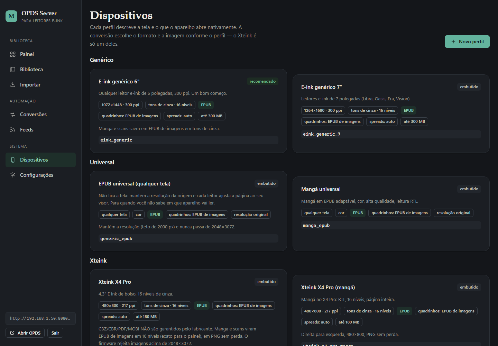
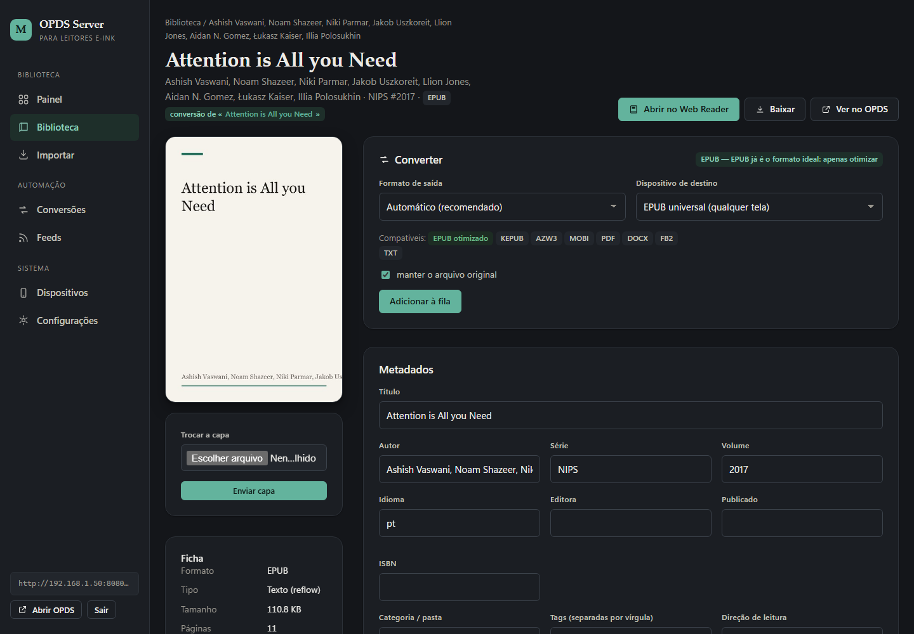

# Painel web

Guia das telas do painel (`http://SEU-IP:8080/`). Toda a interface está em
português; este documento explica o que cada página faz e como executar as
tarefas comuns. O login usa as credenciais do `.env` (`ADMIN_USERNAME` /
`ADMIN_PASSWORD`); se `REQUIRE_AUTH_PANEL=false`, o painel fica aberto.

## Visão geral das páginas

| Caminho | Página | Para quê |
| --- | --- | --- |
| `/` | Painel | resumo do acervo, espaço, ferramentas e acesso OPDS |
| `/import` | Importar | enviar arquivos, varrer pasta, inspecionar |
| `/library` | Biblioteca | buscar, filtrar, editar e agir em lote |
| `/library/{id}` | Livro | ficha do livro: metadados, capa, conversão |
| `/reader/{id}` | Leitor | ler no próprio navegador |
| `/conversions` | Conversões | fila, progresso e histórico |
| `/devices` | Dispositivos | perfis (tela/formatos/qualidade) |
| `/feeds` | Feeds | cadastro e acompanhamento de RSS/Atom |
| `/settings` | Configurações | acesso, senha, manutenção, ferramentas |
| `/setup` | Primeiro acesso | cria a senha e configura o essencial (só em instalação nova) |
| `/login` `/logout` | Sessão | entrar/sair |

---

## Primeiro acesso (`/setup`)

Numa instalação nova (sem senha no banco) **todo o painel** vai para o
assistente, inclusive a API. Ali você:

1. cria **usuário e senha** do painel (mínimo de 8 caracteres);
2. ajusta o essencial: nome da aplicação, raiz do OPDS, autenticação do OPDS,
   endereço base, conversões simultâneas, limite de upload, teto de
   armazenamento e busca automática de feeds;
3. conclui — e já entra logado no painel.

Tudo isso é gravado no **banco cifrado** e vale na hora; não é preciso editar
`.env`. O catálogo OPDS continua acessível durante o assistente (um leitor já
configurado não esbarra nele). Depois, os mesmos campos ficam em
**Configurações → Aplicação e catálogo**.

Para rodar o assistente de novo, apague a linha `admin_password_hash` da tabela
`settings` — ou troque só a senha em **Configurações → Segurança**.

---

## Galeria

Capturas reais (tema escuro, acervo de exemplo).

| Painel | Biblioteca |
| --- | --- |
|  |  |

| Importar | Conversões |
| --- | --- |
|  |  |

| Feeds RSS/Atom | Configurações |
| --- | --- |
|  |  |

| Dispositivos | Ficha do livro |
| --- | --- |
|  |  |

| Leitor: artigo (EPUB) | Leitor: mangá (EPUB de imagens) |
| --- | --- |
|  |  |

---

## Painel (`/`)

Mostra o total de livros, categorias e jobs, o **uso de disco**, a lista de
ferramentas detectadas (internas e opcionais) e um **cartão de acesso OPDS** com
o endereço do catálogo e o estado da raiz. É o ponto de partida: geralmente ele
já traz um atalho para importar quando a biblioteca está vazia.

## Importar (`/import`)

Três blocos:

1. **Enviar arquivos** — selecione ou arraste **vários arquivos**. Aceita EPUB,
   PDF, CBZ/CBR, MOBI/AZW3, DOCX, FB2, TXT, imagens e compactados.
2. **Varrer pasta do servidor** — informe um caminho do próprio servidor, marque
   *recursivo* se quiser subpastas e *mover* para tirar os arquivos do lugar de
   origem.
3. **Inspecionar** — veja o que o servidor entende de um arquivo antes de
   importar.

**A categoria é obrigatória.** Escolha uma categoria já existente na lista ou
digite um nome novo (ele é criado na hora). Para subpastas, use `A/B`
(ex.: `Mangá/One Piece`). Sem categoria a importação é recusada — é o que
mantém a biblioteca e o OPDS organizados.

Na própria tela você pode marcar **converter** e escolher o formato e o
dispositivo, aplicando a conversão a **todos** os arquivos importados de uma vez
(importação em massa com conversão em massa).

> Os feeds **RSS não passam por aqui**: cada feed cria automaticamente a
> categoria `rss/<nome do feed>`.

## Biblioteca (`/library`)

- **Busca** por título/autor e **filtros** por categoria, autor e formato.
- **Grade** ou **lista**, com paginação.
- **Barra de ações em lote** (com os livros marcados):
  - **Converter para** *[formato]* · *[dispositivo]* → **Converter selecionados**
    (conversão em massa);
  - **Atualizar metadados** — reextrai metadados/capa dos arquivos;
  - **Renomear arquivos** — normaliza o nome no disco;
  - **Excluir** — remove os registros e, se marcado, também os arquivos (pede
    confirmação e avisa que não há volta).
- **Selecionar todos** marca a página inteira.

Cada linha leva à ficha do livro.

## Livro (`/library/{id}`)

- Metadados (título, autor, série, volume, idioma, tags), **capa** (enviar uma
  nova) e classificação.
- **Renomear**/mover e **excluir**.
- **Converter** escolhendo formato e dispositivo (ou **Automático**).
- Lista de **formatos disponíveis** e das conversões já feitas (variantes do
  mesmo título).
- Botão para **ler no navegador**.

## Leitor (`/reader/{id}`)

Leitura direta no navegador: EPUB (capítulos e imagens), PDF (páginas), CBZ
(páginas) e texto (TXT/FB2…). Serve para conferir uma conversão — imagens,
ordem dos capítulos — antes de enviar ao aparelho. Navegação de páginas/capítulos
e ajuste de estilo ficam na própria tela.

## Conversões (`/conversions`)

Fila e histórico. Cada job mostra origem, formato/dispositivo de destino,
**progresso** em tempo real e o resultado (ou o erro). Ações: **cancelar** um
job em andamento, **tentar de novo** um que falhou e **limpar** os concluídos.
A concorrência vem de `CONVERSION_CONCURRENCY`.

## Dispositivos (`/devices`)

Lista os perfis embutidos (Xteink, Kindle, Kobo, PocketBook, Boox, Tolino,
reMarkable, genéricos, universal, tablet/mangá) e permite **criar/editar** um
perfil próprio: tela (largura × altura), cor, níveis de cinza, spreads, qualidade
e formato de imagem. Perfis personalizados sobrescrevem os embutidos de mesmo
slug. Ver [`device-formats.md`](device-formats.md).

## Feeds (`/feeds`)

Cadastro de fontes RSS/Atom com frequência de busca, formato de saída, perfil de
dispositivo e pasta/categoria de destino. Ações por feed: **testar**,
**atualizar agora**, **reconstruir** (reprocessar o histórico), **resetar**
(permitir reimportar itens) e **excluir**. O worker roda em background
(`RSS_WORKER_ENABLED`). Detalhes em [`rss.md`](rss.md).

## Configurações (`/settings`)

- **Acesso na rede** e o cartão **OPDS** (endereços, raiz configurada, teste do
  feed).
- **Trocar a senha** do painel.
- **Manutenção**: reparos de capa, caminhos de imagem em EPUBs, links de feed e
  limpeza de temporários.
- **Ferramentas**: o que esta instalação consegue converter e quais opcionais
  foram detectados.

---

## Tarefas comuns

**Importar um lote e já converter**
Importar → arraste os arquivos → escolha/digite a **categoria** → marque
*converter*, escolha formato e dispositivo → enviar.

**Categorizar o que já existe**
Importar exige categoria; para reorganizar depois, abra o livro e use
*renomear/mover*, ou (em lote) mova pela API `/api/books/{id}/move`. Categorias
vazias podem ser removidas pela manutenção.

**Converter muitos livros de uma vez**
Biblioteca → *Selecionar todos* (ou marque alguns) → escolha o formato e o
dispositivo → **Converter selecionados** → acompanhe em Conversões.

**Conferir antes de enviar**
Abra o livro → **Ler no navegador** → valide imagens/capítulos → mande para o
aparelho pelo OPDS.

**Trocar o IP/endereço do catálogo**
Configurações mostra os endereços ativos; se precisar fixar, ajuste `BASE_URL` +
`USE_REQUEST_HOST=false` no `.env` e reinicie.
